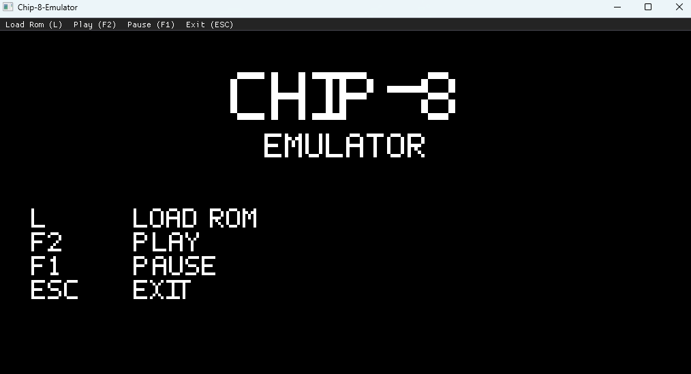
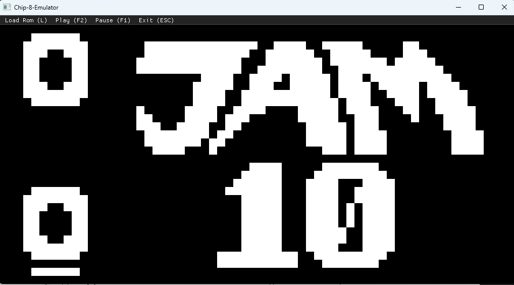
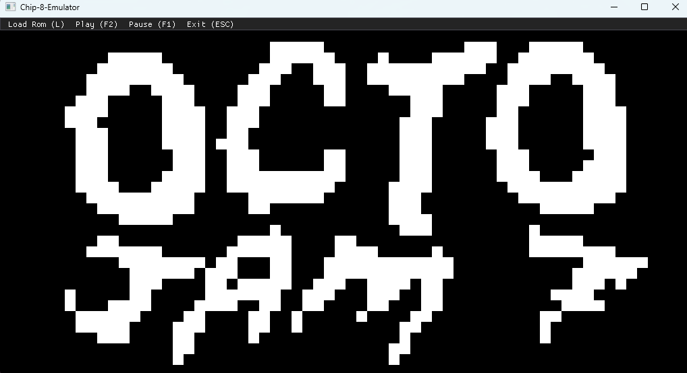
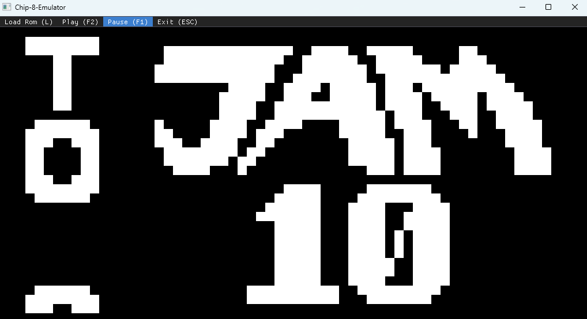

# CHIP-8 Emulator

A simple CHIP-8 emulator written in **C++** using the **SFML (Simple and Fast Multimedia Library)** for graphics, input, and timing.

## Features

- CHIP-8 CPU implementation
- 4096 bytes of memory
- 16 general-purpose registers (V0-VF)
- Index register (indexRegister)
- Program counter (programCounter)
- Stack and stack pointer
- Delay and sound timers
- 64 × 32 monochrome display
- Hexadecimal keypad (16 keys)
- ROM loading
- Instruction fetch-decode-execute cycle
- SFML-based rendering and keyboard input

## Screenshots









## Requirements

- **Compiler:** A C++ compiler supporting **C++17** or higher (e.g., GCC 9+, Clang 10+, or MSVC 2019+).
- **Build System:** [CMake](https://cmake.org/) (version 3.10 or higher recommended).
- **Graphics Library:** [SFML 3.1.0](https://github.com/sfml/sfml) or higher installed on your system.
- **Dear ImGui:** [Dear ImGui 1.91.1](https://github.com/ocornut/imgui), included in this repository.
- **ImGui SFML:** [ImGui SFML 3.0](https://github.com/SFML/imgui-sfml), also included in this repository.

## Building and Running

### 1. Clone the Repository

```bash
git clone https://github.com/DeonDsouza26/Chip-8-Emulator.git
cd chip8-emulator
```

### 2. Create a Build Directory

```bash
mkdir build
cd build
```

### 3. Install SFML

See [Installing SFML](https://github.com/DeonDsouza26/Chip-8-Emulator#installing-sfml-310)

### 4. Configure the Project

```bash
cmake ..
```

### 5. Build the Project

```bash
cmake --build .
```

### 6. Run the Emulator

```powershell
.\emulator.exe
```

## Installing SFML 3.1.0

Since the repository does not include the SFML binaries, you must install or provide **SFML 3.1.0** before building the project.

### SFML installation on Windows

1. Download **SFML 3.1.0** from the official [SFML website](https://www.sfml-dev.org/) or their [github page](https://github.com/SFML/SFML).
2. Extract the downloaded archive.
3. Copy `include`, `lib`, and `bin` folders from the extracted folder into your project's `include/SFML/` directory so that it matches the following structure:

```text
Chip-8-Emulator/
├── include/
│   └── SFML/
│       ├── include/   <-- SFML headers (SFML/Graphics.hpp, etc.)
│       ├── lib/       <-- .lib or .a files
│       └── bin/       <-- .dll files
├── src/
└── CMakeLists.txt
```

> **Note:** This project is developed and tested with **SFML 3.1.0** along with **ImGui-SFML 3.0**. Using a different version may require changes to the build configuration or source code.

## Controls


## Supported Instructions

The emulator implements the standard CHIP-8 instruction set, including:

- Memory operations
- Arithmetic and logic
- Conditional branching
- Stack operations
- Timers
- Display drawing
- Keyboard input
- Random number generation
- ROM loading

## Future Improvements

- Super CHIP support
- Configurable CPU speed
- Audio using SFML
- Debugger
- Configurable key bindings

## References

- [Cowgod's CHIP-8 Technical Reference](http://devernay.free.fr/hacks/chip8/C8TECH10.HTM#0.1)
- [CHIP-8 Wikipedia](https://en.wikipedia.org/wiki/CHIP-8)
- [Tobias V. I. Langhoff's CHIP-8 Guide](https://tobiasvl.github.io/blog/write-a-chip-8-emulator/)
- [Johnearnest's Chip8 ROMs archive](https://johnearnest.github.io/chip8Archive/)

## License

This project is licensed under the MIT License.

## Author

Deon Dsouza

GitHub: https://github.com/DeonDsouza26
